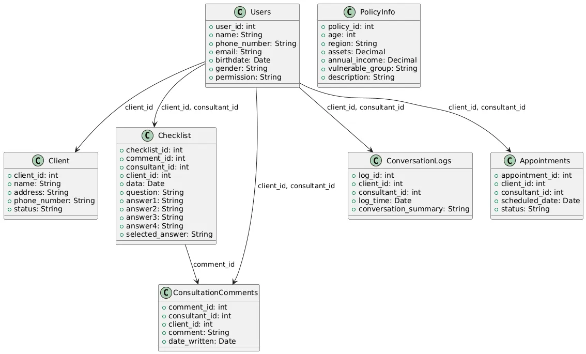

# SafeHi-DB schema


**Users**

- 유저정보 (안심하이 사용자 - 상담가)

**Client**

- 설명 : 등록된 노인정보 Users 에서 사용하는 client_id를 본 테이블 에서 참조.
- 이름 / 거주지 / 전화번호 / status

**PolicyInfo**

- 설명 :  복지정책정보 - 자격 불일치 여부로 제거하는 식으로 설계 (1차개발)
- 나이 / 거주지역 / 자산 / 부부합산연소득 / 취약계층분류(부양가족 및 기초생활수급자, 차상위계층, 한부모가정 중 세대주 및 세대원 전원이 무주택자)


### Revies History
- 2024.10.19 first commit
 - To Be Exceed..

### UML
- Actually, "MySQL Query" is not important. "UML" is really  important. it means "DB Design"
- we can make UML using below code.
- use this link : https://www.planttext.com/#google_vignette

```
@startuml
entity "Users" as U {
  +user_id: int
  +name: String
  +phone_number: String
  +email: String
  +birthdate: Date
  +gender: String
  +permission: String
}

entity "Client" as C {
  +client_id: int
  +name: String
  +address: String
  +phone_number: String
  +status: String
}

entity "PolicyInfo" as P {
  +policy_id: int
  +age: int
  +region: String
  +assets: Decimal
  +annual_income: Decimal
  +vulnerable_group: String
  +description: String
}

entity "Checklist" as CL {
  +checklist_id: int
  +comment_id: int
  +consultant_id: int
  +client_id: int
  +data: Date
  +question: String
  +answer1: String
  +answer2: String
  +answer3: String
  +answer4: String
  +selected_answer: String
}

entity "ConsultationComments" as CC {
  +comment_id: int
  +consultant_id: int
  +client_id: int
  +comment: String
  +date_written: Date
}

entity "ConversationLogs" as L {
  +log_id: int
  +client_id: int
  +consultant_id: int
  +log_time: Date
  +conversation_summary: String
}

entity "Appointments" as A {
  +appointment_id: int
  +client_id: int
  +consultant_id: int
  +scheduled_date: Date
  +status: String
}

C -- CL : client_id
U -- CL : consultant_id
CL -- CC : comment_id
C -- L : client_id
U -- L : consultant_id
C -- A : client_id
U -- A : consultant_id
C -- P : client_id
@enduml

```

# SAFEHI-DB MySQL Query

MySQL 쿼리문을 작성하여 UML 다이어그램에 맞게 DB 테이블을 생성. <br>
다음은 UML에 기반한 테이블 생성 쿼리 (2024.10.19):

```sql
CREATE DATABASE IF NOT EXISTS ConsultantDB;
USE ConsultantDB;

-- Users table
CREATE TABLE Users (
    user_id INT AUTO_INCREMENT PRIMARY KEY,
    name VARCHAR(100),
    phone_number VARCHAR(20),
    email VARCHAR(100),
    birthdate DATE,
    gender VARCHAR(10),
    permission VARCHAR(50)
);

-- Client table
CREATE TABLE Client (
    client_id INT AUTO_INCREMENT PRIMARY KEY,
    name VARCHAR(100),
    address VARCHAR(255),
    phone_number VARCHAR(20),
    status VARCHAR(50)
);

-- PolicyInfo table
CREATE TABLE PolicyInfo (
    policy_id INT AUTO_INCREMENT PRIMARY KEY,
    age INT,
    region VARCHAR(100),
    assets DECIMAL(15,2),
    annual_income DECIMAL(15,2),
    vulnerable_group VARCHAR(50),
    description TEXT
);

-- Checklist table
CREATE TABLE Checklist (
    checklist_id INT AUTO_INCREMENT PRIMARY KEY,
    comment_id INT,
    consultant_id INT,
    client_id INT,
    data DATE,
    question TEXT,
    answer1 VARCHAR(255),
    answer2 VARCHAR(255),
    answer3 VARCHAR(255),
    answer4 VARCHAR(255),
    selected_answer VARCHAR(255),
    FOREIGN KEY (comment_id) REFERENCES ConsultationComments(comment_id),
    FOREIGN KEY (consultant_id) REFERENCES Users(user_id),
    FOREIGN KEY (client_id) REFERENCES Client(client_id)
);

-- ConsultationComments table
CREATE TABLE ConsultationComments (
    comment_id INT AUTO_INCREMENT PRIMARY KEY,
    consultant_id INT,
    client_id INT,
    comment TEXT,
    date_written DATE,
    FOREIGN KEY (consultant_id) REFERENCES Users(user_id),
    FOREIGN KEY (client_id) REFERENCES Client(client_id)
);

-- ConversationLogs table
CREATE TABLE ConversationLogs (
    log_id INT AUTO_INCREMENT PRIMARY KEY,
    client_id INT,
    consultant_id INT,
    log_time DATE,
    conversation_summary TEXT,
    FOREIGN KEY (client_id) REFERENCES Client(client_id),
    FOREIGN KEY (consultant_id) REFERENCES Users(user_id)
);

-- Appointments table
CREATE TABLE Appointments (
    appointment_id INT AUTO_INCREMENT PRIMARY KEY,
    client_id INT,
    consultant_id INT,
    scheduled_date DATE,
    status VARCHAR(50),
    FOREIGN KEY (client_id) REFERENCES Client(client_id),
    FOREIGN KEY (consultant_id) REFERENCES Users(user_id)
);
```

### DB BackUp - 파일로 내보내기

이 DB를 파일로 저장하고, 다른 컴퓨터에서도 쉽게 세팅하려면 아래 절차를 따르면 됩니다:

Mysql Database 백업파일 생성 및 DB 옮기는 법 (.sql 및 mysqldump 사용법)
https://juntheworld.tistory.com/178

이러면 다른 컴퓨터에서도 동일한 DB 구조를 쉽게 설정할 수 있습니다.


# General MySQL Query

데이터베이스 상태를 확인할 수 있는 여러 쿼리문을 제공합니다. 각각의 쿼리는 DB의 다양한 요소를 확인하는 데 사용됩니다.

1. 데이터베이스 목록 확인
현재 MySQL 서버에 존재하는 모든 데이터베이스 목록을 확인하려면 다음 쿼리를 사용할 수 있습니다:

```sql
SHOW DATABASES;
```

2. 테이블 목록 확인
현재 사용 중인 데이터베이스의 테이블 목록을 확인하려면:


```sql
SHOW TABLES;
```
특정 데이터베이스를 지정하여 테이블을 확인하려면:

```sql
USE ConsultantDB;
SHOW TABLES;
```

3. 테이블 구조(스키마) 확인
특정 테이블의 구조(필드 정보)를 확인하려면:

```sql
DESCRIBE Users;
```
이 명령어는 테이블의 각 필드 이름, 데이터 타입, NULL 허용 여부, 기본값 등을 보여줍니다.

4. 테이블에 저장된 데이터 확인
특정 테이블에 저장된 데이터를 확인하려면:
```sql
SELECT * FROM Users LIMIT 10;
```
여기서는 테이블 Users의 상위 10개의 데이터를 보여줍니다.

5. 데이터베이스 용량 및 테이블 상태 확인
데이터베이스의 각 테이블의 상태와 크기를 확인하려면:

```sql
SELECT table_name AS 'Table',
       round(((data_length + index_length) / 1024 / 1024), 2) AS 'Size (MB)'
FROM information_schema.TABLES
WHERE table_schema = 'ConsultantDB'
ORDER BY (data_length + index_length) DESC;
```

이 쿼리는 각 테이블의 크기를 MB 단위로 보여줍니다.

6. 인덱스 확인
테이블에 설정된 인덱스를 확인하려면:

```sql
SHOW INDEX FROM Users;
```
특정 테이블에 대한 인덱스 정보와 인덱스가 설정된 컬럼을 보여줍니다.

7. 데이터베이스 상태 확인
MySQL 서버의 전체적인 상태를 확인하려면:

``` sql
SHOW STATUS;
```

이 명령어는 서버의 다양한 상태 값(예: 현재 접속 상태, 실행된 쿼리 수, 업타임 등)을 확인할 수 있습니다.


8. 현재 사용 중인 데이터베이스 확인
현재 사용 중인 데이터베이스가 무엇인지 확인하려면:

```sql
SELECT DATABASE();
```

9. MySQL 서버의 버전 및 설정 정보 확인
MySQL 서버의 버전과 기본 설정을 확인하려면:

```sql
SELECT VERSION();
SHOW VARIABLES;
```

이 쿼리는 MySQL 서버의 버전과 환경 변수를 보여줍니다.